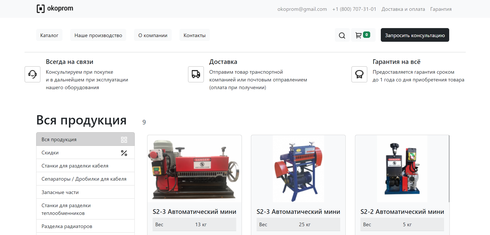
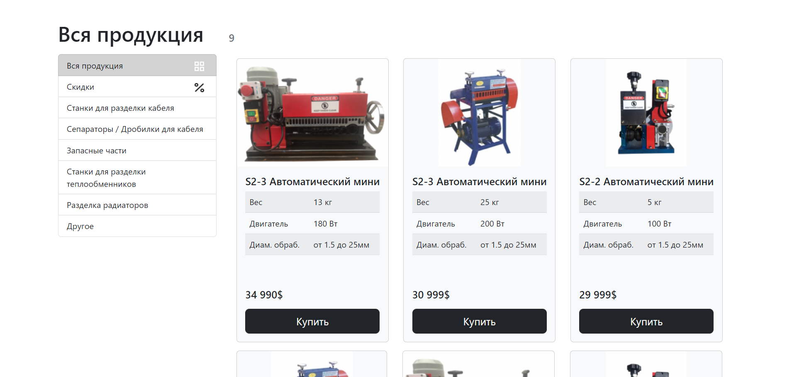
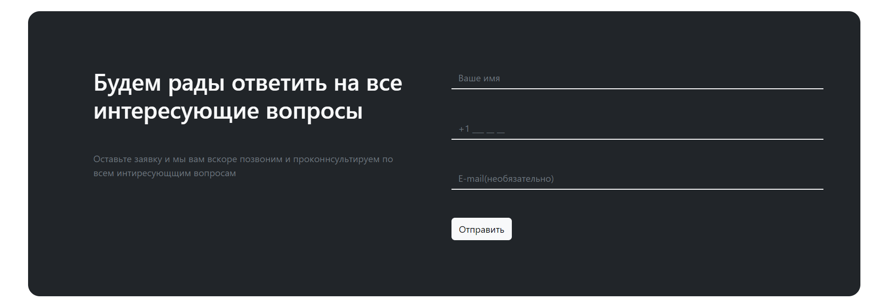
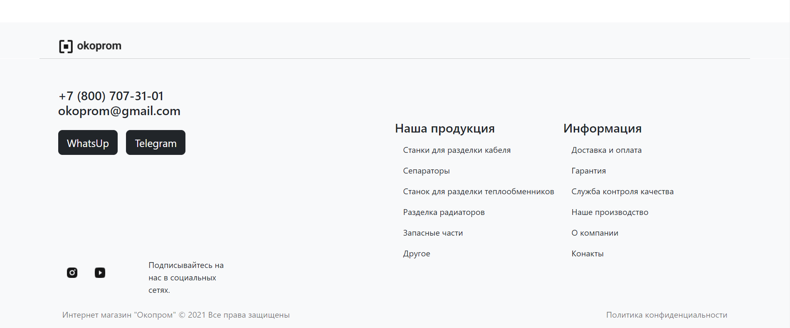
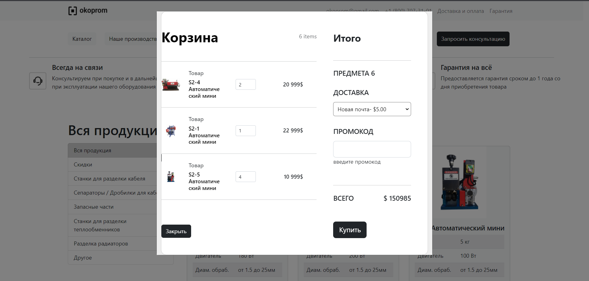
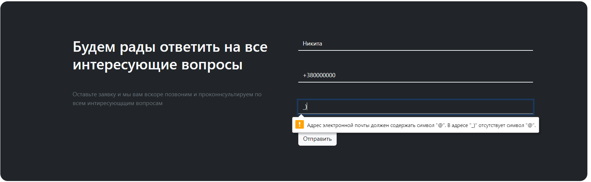
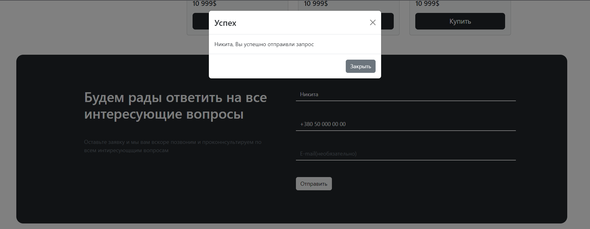

<h1>okoprom</h1>

Term paper for NIX-FE practice

<h2>Demo</h2>

<h2>General Information</h2>

The project was created according to the <a href="https://www.figma.com/proto/uNxChljndyqfEw3JUF4xdz/Practice-Project-2" target="_blank"> given layout </a>

<h2>Technologies Used</h2>

<ul>
    <li>HTML</li>
    <li>CSS</li>
    <li>JavaScript</li>
    <li>React</li>
    <li>React-Bootstrap</li>
</ul>
<h2>Setup</h2>

Clone down this repository. You will need node and npm installed globally on your machine.

 
Installation

`npm install`

To Start Server:

`npm start`

To Visit App:

`localhost:3000/`

<h2>Screenshots</h2>

    <h3> Main page: </h3>
     
     
     
     
    <h3> Shopping Cart: </h3>
     
    <h3> Interactive windows </h3>
     
    
    <h3> Shopping cart is fully interactive </h3>
    <ul>
      <li>Add\delete</li>
      <li>Inspect</li>
      <li>Total price</li>
      <li>...</li>
    </ul>

